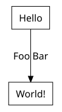
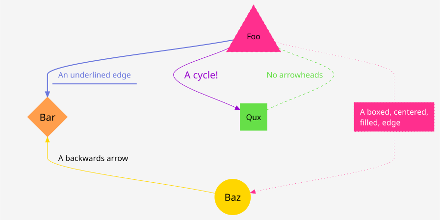
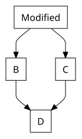

# Vizdom

Vizdom is a declarative graph layout and rendering engine compiled from Rust to
WebAssembly using `wasm-pack`. It provides an API for creating and rendering
directed graphs and producing SVGs.

## Goals

- 💾 **Low memory footprint**
- 🎉 **No system dependencies**
- 🚀 **Fastest layout and rendering engine powered by WebAssembly**
- 🔥 **Works in any client / server configuration**

## Features

- 🛠️ Create and manipulate **directed** graphs.
- 🔀 Handles multiple edges with the same `source` and `target` nodes.
- 🔄 Render **cyclical** directed graphs.
- 🎨 Support various custom rendering attributes for enhanced visualization.

## Installation

Vizdom comes in several distributions:

- `esm` (Modern)
- `node` (CJS)
- `web` (Browser)

Simply select a distribution and install using your favorite package manager
following the saming convention `@vizdom/vizdom-ts-<dist>`.

```sh
npm install @vizdom/vizdom-ts-esm
pnpm install @vizdom/vizdom-ts-esm
yarn install @vizdom/vizdom-ts-esm
bun install @vizdom/vizdom-ts-esm
```

## 🚴 Usage

In the most basic configuration, all you need is to provide labels for nodes and
edges.

```typescript
import { DirectedGraph } from "@vizdom/vizdom-ts-esm";
// ... or CJS
// const { DirectedGraph } = require("@vizdom/vizdom-ts-node");

// Create a new graph
const graph = new DirectedGraph();

// Add vertices
const v0 = graph.new_vertex({
  render: {
    label: "Hello",
  },
});
const v1 = graph.new_vertex({
  render: {
    label: "World!",
  },
});

// Add an edge between the vertices
graph.new_edge(v0, v1, {
  render: {
    label: "Foo Bar",
  },
});

// Position the graph
const positioned = graph.layout();

// Finally, obtain to an SVG
await fs.writeFile("./graph.svg", positioned.to_svg().to_string());
```

Check out the [basic example](examples/basic/index.mjs), which produces a graph
that looks like:



## Layout Engine

Vizdom can be used as a pure layout engine to obtain positioning information,
which is especially useful if you already have a method for rendering your
graph.

### Specifying Layout Parameters

To use Vizdom for layout purposes, you need to provide the bounding box
dimensions. If you are using the library in a browser context, you can retrieve
these dimensions by using methods like
[getBoundingClientRect()](https://developer.mozilla.org/en-US/docs/Web/API/Element/getBoundingClientRect)
on the HTML element. Compute the `shape_w` (width) and `shape_h` (height) and
pass them as `layout` parameters.

Additionally, there's an optional argument, `compute_bounding_box`, which can be
set to `false`. This tells the library to use the provided layout values for the
bounding box instead of computing it from the `label` attribute. By default, the
shape is considered to be a `Shape.Rectangle` for nodes and `Shape.Plaintext`
for edges (which is also a rectangle) and should remain unchanged in this
context.

### Providing IDs

Each vertex and edge requires an `id` to map the JSON result correctly. The
resulting JSON string will include these IDs, enabling accurate mapping of the
nodes and edges.

```typescript
// ...
const v0 = graph.new_vertex(
  {
    layout: {
      shape_w: 10,
      shape_h: 10,
    },
    render: {
      id: "v0",
    },
  },
  {
    compute_bounding_box: false,
  }
);

// ...

// Similarly, for an edge you have the same API.
const e0 = graph.new_edge(
  v0,
  v1,
  {
    layout: {
      shape_w: 10,
      shape_h: 10,
    },
    render: {
      id: "e1",
    },
  },
  {
    compute_bounding_box: false,
  }
);

// Position the graph
const positioned = graph.layout();

// Obtain the json instance
const json = positioned.to_json();

// Get a JS/TS Object adhereing to the `IJsonPosition` interface.
const jsonObj = json.to_obj();

// Or get the JSON string directly
const jsonString: string = json.to_string();
// const jsonStringPretty: string = json.to_string_pretty();
```

For a practical example, check out the [json example](examples/json/index.mjs),
which generates a positional JSON string similar to
[this](examples/json/graph.json).

## Styling Attributes

Vizdom supports several layout and rendering options for those who want more
control over the appearance of their graphs.

```typescript
const v0 = graph.new_vertex({
  render: {
    label: "Foo",
    color: "#ff2f8e",
    fill_color: "#ff2f8eaa",
    shape: Shape.Triangle,
    style: VertexStyle.Dashed,
  },
});
```

Check out the [style example](examples/styles/index.mjs), which produces a graph
that looks like:



## 📈 Diff Viewer 📉

You can visually compare two graphs with Vizdom. Ensure that the `id` attributes
are set and unique to track changes effectively. The resulting graphs will be
annotated with a 'glow' effect to highlight differences:

- ❌ Removed elements (`id` no longer exists) are highlighted in **red**.
- ✅ Added elements (`id` is new) are highlighted in **green**.
- 🟧 Modified elements (`id` is the same, but other attributes have changed) are
  highlighted in **orange**.

Check out the [diff example](examples/diff/index.mjs), which produces two graphs
that look like:


and



## License

Licensed under the Apache License, Version 2.0. See the [LICENSE](LICENSE) file
or visit
[https://www.apache.org/licenses/LICENSE-2.0](https://www.apache.org/licenses/LICENSE-2.0)

## Closed-Source Notice

Please note that while Vizdom is freely available for use under the Apache
License 2.0, the Rust WebAssembly binary included in this library is
closed-source. You are free to use the library, but the source code for the Rust
WebAssembly binary is not publicly available.
